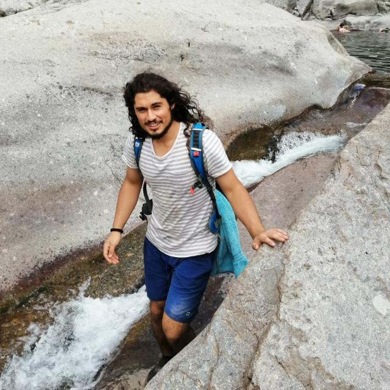
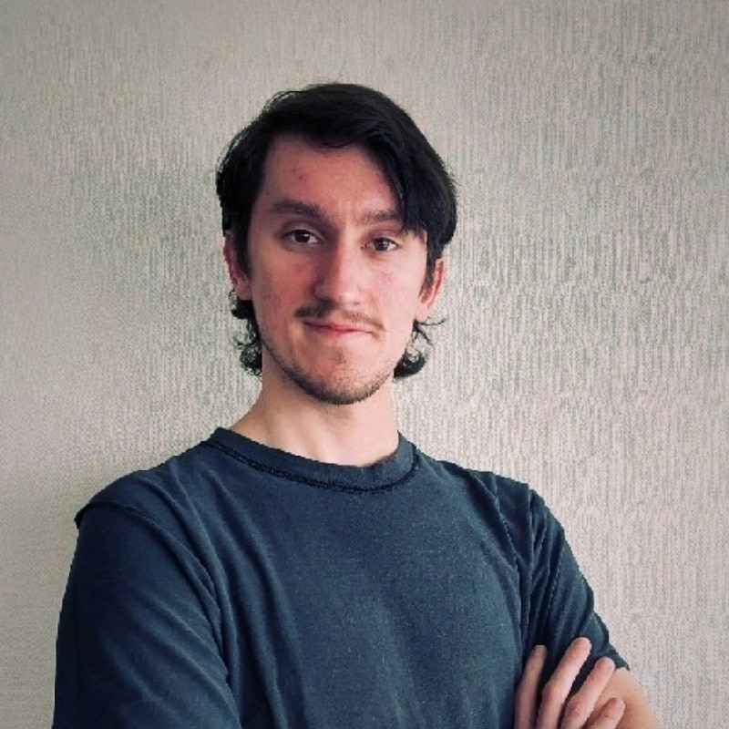
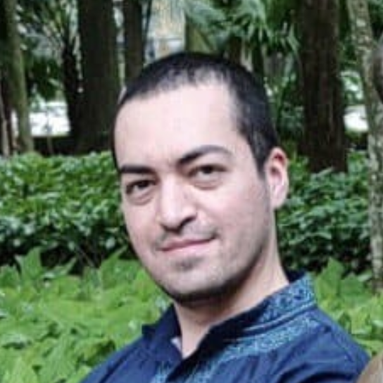
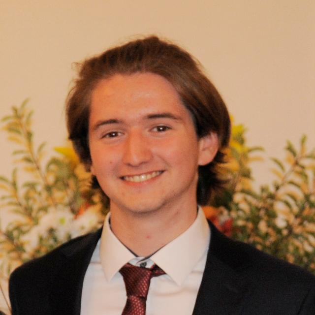

# 🏛 Our Team

Welcome to our lab! We are a passionate team of researchers dedicated to **molecular electronics, optoelectronics and nanomaterials**. Our mission is to push the boundaries of science and develop cutting-edge solutions for next-generation devices.

---

## 👩🏼‍🔬 Principal Investigator

### **Dr. Diana Dulić**  

🏛 **Affiliation:** Universidad de Chile  
📧 **Email:** [diana.dulic@gmail.com](mailto:diana.dulic@gmail.com)  
🌐 **Google Scholar:** [Diana Dulić](https://scholar.google.com/citations?user=6PJLDzkAAAAJ&hl=en)  

---

## 🔬 MSc. Students

### **Guillermo Aburto Contreras**  
  

🏛 **Affiliation:** Universidad de Chile  
📧 **Email:** [guillermo.aburto@ug.uchile.cl](mailto:guillermo.aburto@ug.uchile.cl)  
🌐 **Google Scholar:** [Guillermo Aburto](#)  

---

### **Diego Sanz Biava**  
  

🏛 **Affiliation:** Universidad de Chile  
📧 **Email:** [diego.sanz@ug.uchile.cl](mailto:diego.sanz@ug.uchile.cl)  
🌐 **Google Scholar:** [Diego Sanz](#)  

---

### **Joaquín López**  
  

🏛 **Affiliation:** Universidad de Chile  
📧 **Email:** [joaquin.mph7@gmail.com ](mailto:joaquin.mph7@gmail.com )  
🌐 **Google Scholar:** [Joaquín López](#)  

---

## ⚡ Lab's Engineer

### **Tomás Rojas Castiglione**  
  

🏛 **Affiliation:** Universidad de Chile  
📧 **Email:** [tomas.rojas.c@ug.uchile.cl](mailto:tomas.rojas.c@ug.uchile.cl)  
🌐 **Google Scholar:** [Tomás Rojas](https://scholar.google.com/citations?user=I7ZapO8AAAAJ&hl=en)  

---

## 💻 Lab's Software Engineer

### **Benjamín Briceño Elchiver**  
  

🏛 **Affiliation:** Universität Augsburg, Institute for Physics, Germany  
📧 **Email:** [benjaminbriceno@ug.uchile.cl](mailto:benjaminbriceno@ug.uchile.cl)  
🌐 **Google Scholar:** [Benjamín Briceño](#)  

---

## 🎓 Alumni

- **Dr. Alfredo Rates** – 🔗 [LinkedIn](https://www.linkedin.com/in/alfredorates/)  

- **Dr. Jacqueline Labra Muñoz** - 🔗 [LinkedIn](https://www.linkedin.com/in/jacqueline-labra-munoz/)  

- **Eng. Tomás Rojas Castiglione** - 🔗 [LinkedIn](https://www.linkedin.com/in/tom%C3%A1s-rojas-castiglione/)  

---

## 🎯 Want to Join Us?  
Our lab welcomes motivated students and researchers! If you're interested in **optoelectronics, nanomaterials, or device engineering**, feel free to **reach out**. 🚀  

📩 **Contact:** [diana.dulic@gmail.com](mailto:diana.dulic@gmail.com)   
📍 **Location:** Avenida Blanco Encalada 2008, Santiago, Chile
